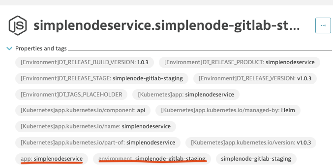

# dta event send deploy

The sub-command `dta event send deploy` sends a deployment event to Dynatrace that updates the [release inventory](https://www.dynatrace.com/support/help/platform-modules/cloud-automation/release-monitoring/monitor-releases-with-dynatrace).

## Getting started with deployment events

1. Go to Dynatrace and find your application Process Group Instance (PGI) in the UI. Locate the combination of tags that uniquely identify your PGI. This information will be used in the entity selector.

   Example image:

   

1. Run the following command to trigger a new deployment event.

```(bash)
dta event send deploy --entity-selector "type(PROCESS_GROUP_INSTANCE),tag(your-pgi-tag)" --name "app-deploy-v1-example" --version "v1.0.0"
```

1. Navigate into Dynatrace and check the release inventory being update with the latest version.

### Required Values

The required values for this command are:

| Command           | Environment variable | Description                                                                             |
| ----------------- | -------------------- | --------------------------------------------------------------------------------------- |
| --entity-selector | DT_ENTITY_SELECTOR   | Dynatrace entity selector expression : i.e.type(PROCESS_GROUP_INSTANCE),tag(easytravel) |
| --name            | DT_EVENT_DEPLOY_NAME | Deployment event name. i.e. App-simplenode-Release-1.0.0                                |
|                   |

### Optional Values

The optional values for this command are:

| Command                   | Environment variable       | Description                                                                                                                    |
| ------------------------- | -------------------------- | ------------------------------------------------------------------------------------------------------------------------------ |
| --version                 | DT_RELEASE_VERSION         | Deployment version. i.e. 1.0.0. default: ""                                                                                    |
| --project                 | DT_PROJECT                 | Project name. i.e. simple-node-project. default: ""                                                                            |
| --source                  | DT_SOURCE                  | Source name. i.e. Jenkins, Gitlab, etc. default: ""                                                                            |
| --release-stage           | DT_RELEASE_STAGE           | Release stage for the application. i.e. dev, staging, etc. default: ""                                                         |
| --release-product-name    | DT_RELEASE_PRODUCT         | Release product name (useful when having multiple component of a single application) i.e. your-app-commercial-name default: "" |
| --release-build-version   | DT_RELEASE_BUILD_VERSION   | Release build version i.e. your internal build id (git commit id, cicd build id, etc) default: ""                              |
| --approver                | DT_APPROVER                | Approver name for the deployment. default: ""                                                                                  |
| --ci-back-link            | DT_CI_BACK_LINK            | CI/CD back link i.e. https://pipelines/easytravel/123 . default: ""                                                            |
| --gitcommit               | DT_GITCOMMIT               | Git commit id. default: ""                                                                                                     |
| --change-request          | DT_CHANGE_REQUEST          | Change request code if applicable default: ""                                                                                  |
| --remediation-action-link | DT_REMEDIATION_ACTION_LINK | Remediation link for auto-remediation scenarios that you might want to implement                                               |
| --is-root-cause-relevant  | DT_ROOT_CAUSE_RELEVANT     | Set's if this would be relevant to a root cause analysis from Dynatrace Davis AI. default: true                                |

The best practices for setting the version detection with Dynatrace include the definition of at least the following variables:

- DT_RELEASE_VERSION for Version
- DT_RELEASE_STAGE for Stage
- DT_RELEASE_PRODUCT for Product
- DT_RELEASE_BUILD_VERSION for Build version

You can read more information [here](https://www.dynatrace.com/support/help/platform-modules/cloud-automation/release-monitoring/version-detection-strategies)

## Resources

- [Dynatrace Events V2 API docs](https://www.dynatrace.com/support/help/dynatrace-api/environment-api/events-v2/get-event-types)
