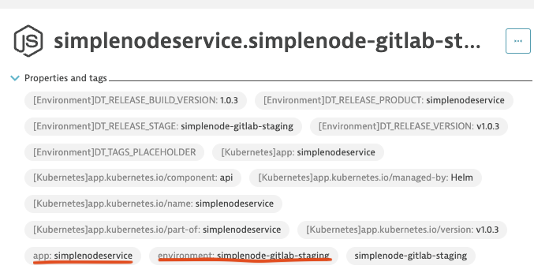

# Dynatrace Events

The `dta event` command automates the process of sending events to Dynatrace.

### Getting started

1. Download the CLI from this repo or use the docker container version [Main Docs](/README.md).
1. Generate an Oauth2 token with the scopes `storage:events:write`. Details about generating and configuring [Authentication](/docs/Authentication.md) tokens.
1. Follow instructions specific for each command.

## Deploy command

The subcommand `dta event deploy` sends a deployment event to Dynatrace that updates the release inventory.

## Instructions

1. Go to Dynatrace and find your application Process Group Instance (PGI) in the UI. Locate the combination of tags that uniquely identify your PGI. This information will be used in the entity selector.
   Example image:
   

1. Run the command `dta event deploy --entity-selector "type(PROCESS_GROUP_INSTANCE),tag(your-pgi-tag)" --name "app-deploy-v1-example" --version "v1.0.0` to trigger a new deployment event.
1. Navigate into release inventory in Dynatrace and check the release inventory being update with the latest release.

## Resources

- [Dynatrace Events V2 API docs](https://www.dynatrace.com/support/help/dynatrace-api/environment-api/events-v2/get-event-types)
