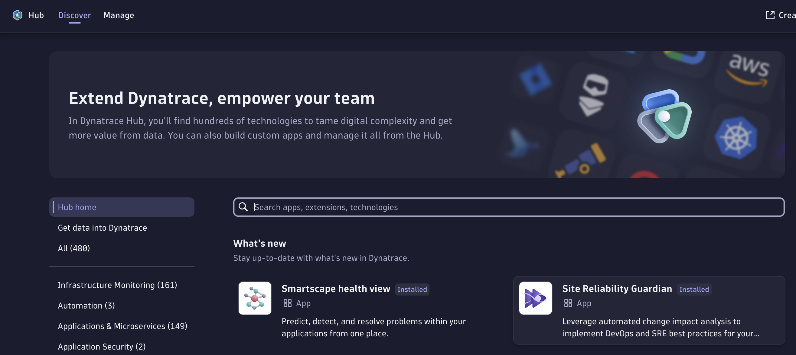

# Site Reliability Guardian (SRG) - initial setup

To configure the initial Site Reliability Guardian for a CI/CD usage follow the steps:

1. Install the Site Reliability Guardian in your Dynatrace Environment.
   
1. Create a SLO definition in Dynatrace. You will need to identify a service that you want to monitor and then create a basic SLO expression. Later, you can enhance or replace this definition with a more complex SLO.
   If you want to quickly started, you can use an expression like this one: `response_time: `
   
1. Create a Site Reliability application
1. Create a workflow that includes the SRG application as a step and as trigger the following expression
