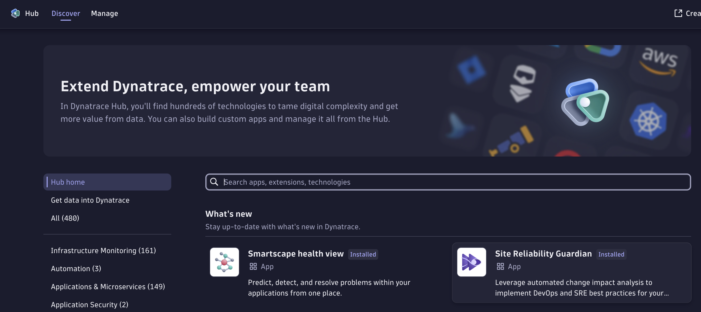

# Site Reliability Guardian (SRG) - initial setup

To configure the initial Site Reliability Guardian for a CI/CD usage follow the steps:

## 1. Install the Site Reliability Guardian

Search in the Dynatrace Hub for the Site Reliability Guardian and install it in your Dynatrace Environment.



## 2. Create an SLO definition with DQL

## 2.(Optional) Create a SLO definition in Dynatrace

You need to identify a service that you want to monitor and then create a basic SLO expression. Later, you can enhance or replace this definition with a more complex SLO.
If you want to get started quickly, you can use an expression like this one:

```
((builtin:service.response.time:avg:partition("latency",value("good",lt(400000))):splitBy():count:default(0))/(builtin:service.response.time:avg:splitBy():count)*(100))
```

> This expression measures service performance by counting the number of request during which the response latency is below the defined threshold 400000 [µs] or 400 ms.

For the entity filters, you can use a combination of entity type and tags to find the target entity in Dynatrace. i.e.:

```
type("SERVICE"),tag("[Environment]DT_RELEASE_PRODUCT:simplenodeservice","environment:canary")
```


## 3. Create a Site Reliability application

Create a new Site Reliability Guardian and add the label `appname:yourappname`. This will be the key property that you will use in the next part to identify this specific guardian using the CLI.


Select the SLO definition created in Dynatrace during the previous step as part of the guardian configuration.


Finally, set the thresholds for the Site Reliability Guardian as the following image.


> Note: The return value of the SLO is a percentage from 0 to 100% where, 100% means that all the request in the specified timeframe are lower than the maximum value of 400ms. The thresholds set for this SLO are:
>
> - 99% for a warning (for every 100 requests 1 request slower than 400ms)
> - 95% for a failure (for every 100 requests 5 requests are slower than 400ms)

## Create a Dynatrace Workflow

Create a Dynatrace Workflow that includes the Site Reliability Guardian application as a step and is triggered based on the following Biz Event:

```
type == "com.dynatrace.event.srg.evaluation.triggered.v1" AND appname=="appnamehere"
```

You will need to replace `appnamehere` with the value that you configured on step 3.


Then add the SRG item with the following expression to get the start time and end time of the event into the execution:


With this final step you are ready to execute a Site Reliability Guardian evaluation.
