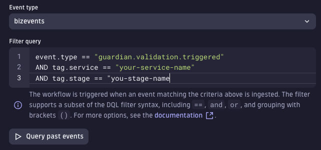

# Site Reliability Guardian (SRG) - initial setup

To configure the initial Site Reliability Guardian for a CI/CD usage follow the steps:

Pre-requisites:

- One agent already monitoring at least one host.

## 1. Install the Site Reliability Guardian

Search in the Dynatrace Hub for the Site Reliability Guardian and install it in your Dynatrace Environment.


## 2. Create a new Guardian

Locate the Site Reliability Guardian app in the sidebar an click `+ guardian` button.


You need to identify a host/process that you want to monitor and then create a basic SLO expression. Later, you can enhance or replace this definition with a more complex SLO.
If you want to get started quickly, you can use an expression like this one in the DQL input box:

```
timeseries avg(dt.host.cpu.usage), alias:cpu,  filter:{host.name == "your-host-name-here"} | fields cpu_single = arrayMax(cpu)
```

This expression fetches the max cpu usage for the timeframe of the evaluation (from 0 to 100%).

You can then add some thresholds to control the CPU usage during the test like in the image. You can later fine tune those values depending on the real values of your server/app.


<details>

<summary>(Optional) Add SLO service metrics from Dynatrace SLO UI</summary>
If you want to consume service metrics like `response time` or `error rate` of a service you need to create a SLO in the previous Dynatrace UI:

1.  Go to Cloud Automation > Service-level objectives and create a new SLO

    

    Under the metric expression you can use this example:

    ```
    ((builtin:service.response.time:avg:partition("latency",value("good",lt(400000))):splitBy():count:default(0))/(builtin:service.response.time:avg:splitBy():count)*(100))
    ```

    > This expression measures service performance by counting the number of request during which the response latency is below the defined threshold 400000 [µs] or 400 ms. (you need to have traffic against your application for this expression to work)

    For the entity filters, you can use a combination of entity type and tags to find the target entity in Dynatrace. i.e.:

    ```
    type("SERVICE"),tag("[Environment]DT_RELEASE_PRODUCT:simplenodeservice","environment:canary")
    ```

    > Note: Replace this tags `"[Environment]DT_RELEASE_PRODUCT:simplenodeservice","environment:canary"` with your service tags.

    

2.  Add the SLO in the Site Reliability guardian created in the previous step.
    Select the SLO definition created in Dynatrace during the previous step as part of the guardian configuration.

        
        Finally, set the thresholds for the Site Reliability Guardian as the following image.
        

        > Note: The return value of the SLO is a percentage from 0 to 100% where, 100% means that all the request in the specified timeframe are lower than the maximum value of 400ms. The thresholds set for this SLO are:
        >
        > - 99% for a warning (for every 100 requests 1 request slower than 400ms)
        > - 95% for a failure (for every 100 requests 5 requests are slower than 400ms)

    </details>

--

## 3. Create a Dynatrace Workflow

Create a **Dynatrace Workflow** that includes the Site Reliability Guardian application as a step and is triggered based on the following Biz Event:

```
type == "guardian.validation.triggered" AND tag.application=="appnamehere"
```

You will need to replace `appnamehere` with a value of your choice for the application name. This value would be used during the CLI execution to trigger this specific workflow.



Then add the SRG item with the following expression to get the start time and end time of the event into the execution:


With this final step you are ready to execute a Site Reliability Guardian evaluation.

Continue in the main guide
[Site Reliability Guardian Automation](docs/Site-Reliability-Guardian/SRGAutomation.md)
