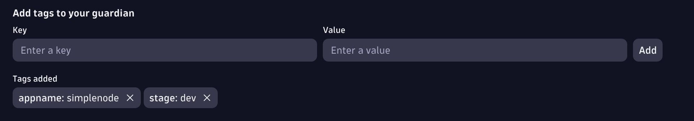

# Site Reliability Guardian

The `dta srg evaluate`allows to automate the process of executing Site Reliability Automation from a CI/CD or automation platform.

## Getting started

1. Follow the guide [Here](./SRGAutomation-initial-setup.md) to configure the base SRG application and workflow. This is currently a manual process.
1. Download the CLI or use the docker container version [Main Docs](../README.md)\
1. Generate an Oauth2 token with the scopes `storage:bizevents:read storage:events:write`. Details about [Authentication](./Authentication.md)
1. Run the command `dta srg evaluate <appname>` to trigger a new quality gate evaluation.

## SRG evaluate command

The command `dta srg evaluate <appname>` triggers the following process:

1. A Biz Event is send into Dynatrace with the required details for the quality gate evaluation including start time, end time and application name.
2. On the Dynatrace side, a Dynatrace Workflow is already configured and is listening for the Biz Event payload based on the event type and application name.
3. The Dynatrace Workflow triggers the Site Reliability Guardian evaluation and sends the input parameters from the biz event.
4. The evaluation is executed and a Biz Event is created by the SRG app with the evaluation results and the metadata that the evaluation definition contains (labels)
5. The CLI queries Dynatrace API for the Biz Event that matches the appname (provided in the previous step as a label) and the timeframe for the evaluation.

### Required and optional configurations

The required values for this command are:

- appname: This is the application or service name. This value should match a **label** in the Site Reliability Guardian called `appname`.
  

The available options for this command are:

- start-time and end-time (start-time and end-time)
- timespan (last x mins) (this conflicts with start-time end-time, so only one should be defined)
- stage
- service
- labels
- gitCommitId

The return payload after this command is executed includes:

- evaluation_event_id
- evaluation_result
- evaluation_url_link
