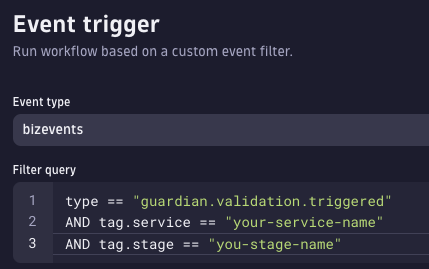

# Site Reliability Guardian (SRG)

The `dta srg evaluate` allows to automate the process of executing Site Reliability Automation from a CI/CD or automation platform.

## Getting started

1. Follow the guide [here](./SRGAutomation-initial-setup.md) to configure the example SRG application and workflow. This is currently a manual process.
1. Download the CLI from this repo or use the docker container version [Main Docs](/README.md).
1. Generate an Oauth2 token with the scopes `storage:bizevents:read storage:events:write`. Details about generating and configuring [Authentication](/docs/Authentication.md) tokens.
1. Run the command `dta srg evaluate <appnamehere>` to trigger a new quality gate evaluation for the last 5 mins of data. Where the `appnamehere` is the value you setup for the application name on step 1.

## SRG evaluate command details

The command `dta srg evaluate <appnamehere>` triggers the following process:

1. A Biz Event is send into Dynatrace with the required details for the quality gate evaluation including start time, end time and application name.
2. On the Dynatrace side, a Dynatrace Workflow is already configured and is listening for the Biz Event payload based on the expression `event.type == "guardian.validation.triggered" AND tag.application=="appnamehere"`
3. The Dynatrace Workflow triggers the Site Reliability Guardian evaluation and sends the input parameters from the biz event into the SRG evaluation.
4. The evaluation is executed and a Biz Event is created by the SRG application with the evaluation results and the metadata that allows the CLI to query for this specific result.
5. The CLI queries Dynatrace API for the Biz Event that matches an internal ID that was send on step 1. By default, it will retry this query every 5 seconds for 12 times until it finds the result event. If the number of retries is exceeded an no event is present, the CLI will assume the configuration is broken and the execution will fail.

### Required Values

The required values for this command are:

| Command   | Environment variable   | Description                                                 |
| --------- | ---------------------- | ----------------------------------------------------------- |
| --service | SRG_EVALUATION_SERVICE | Service name. i.e. backend-service, api-gateway, etc.       |
| --stage   | SRG_EVALUATION_STAGE   | Evaluation stage, can be dev, test,quality-gate, prod, etc. |

- appname:

  

Authentication configs: Additionally you need to configure the environment variables for the authentication as described here [Authentication](./Authentication.md)

### Optional Values

The optional values are send as part of the BizEvent into Dynatrace and can be use to futher enhance the validation process

| Command           | Environment variable           | Description                                                                                                                                   |
| ----------------- | ------------------------------ | --------------------------------------------------------------------------------------------------------------------------------------------- |
| --start-time      | SRG_EVALUATION_START_TIME      | Evaluation start time. ISO 8601 format expected                                                                                               |
| --end-time        | SRG_EVALUATION_END_TIME        | Evaluation end time. ISO 8601 format expected                                                                                                 |
| --timespan        | SRG_EVALUATION_TIMESPAN        | Grab the last X minutes of data for the evaluation (default: "5"). This conflicts with start-time and end-time so only one can be set at once |
| --application     | SRG_EVALUATION_APPLICATION     | This is the application or service name. default: ""                                                                                          |
| --provider        | SRG_EVALUATION_PROVIDER        | Provider of the request. i.e. github, jenkins, jenkins-production-1 etc. default: "cicd"                                                      |
| --version         | SRG_APP_VERSION                | Version of the app. i.e. v1.0.1. default: ""                                                                                                  |
| --buildId         | SRG_EVALUATION_BUILD_ID        | Build ID. optional for reference in the evaluation. Can also be used for the Git commit ID. default: ""                                       |
| --stop-on-failure | SRG_EVALUATION_STOP_ON_FAILURE | stop execution if evaluation fails. default: "true"                                                                                           |
| --stop-on-warning | SRG_EVALUATION_STOP_ON_WARNING | stop execution if evaluation has a warning result. default: "false"                                                                           |

Each option can be set as an environment variable

i.e. `dta srg evaluate --start-time=2023-03-29T23:27:15.301Z` can be set as

```
export SRG_EVALUATION_START_TIME=2023-03-29T23:27:15.301Z
dta srg evaluate
```

To enable additional **LOGS** you can set the environment variables:

- LOG_LEVEL=verbose
- LOG_FILE=true

### Result event

The return payload after this command is executed includes:

- Evaluation Result:
  Status: `pass` or `fail`. If you get `error` as a result, there is a configuration issue.
- SLO summary: Number of SLO with pass, warning an fail results.
- evaluation_url_link: Link to Dynatrace SRG evaluation

## Pipeline integration examples

Currently, we provide the following examples for CICD integration:

1.  [Gitlab integration](./example-pipelines/Gitlab/readme.md)
1.  [Jenkins integration](./example-pipelines/Jenkins/readme.md)

> Note: Other CICD providers can consume the CLI or docker container version.
