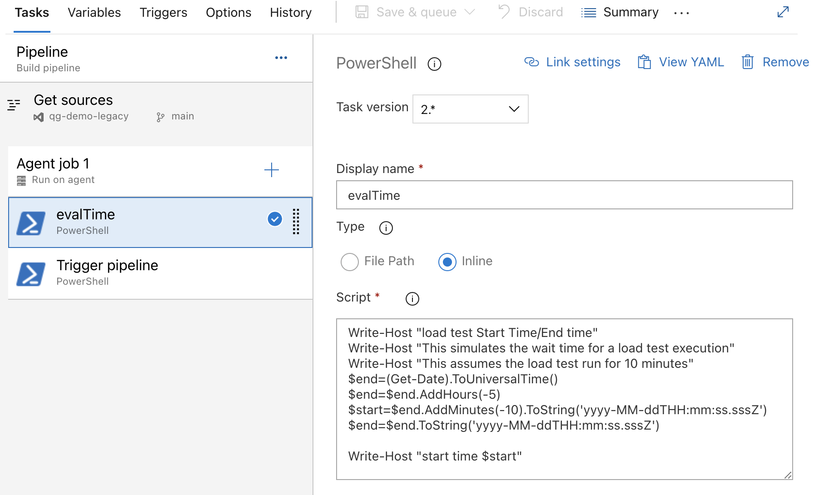
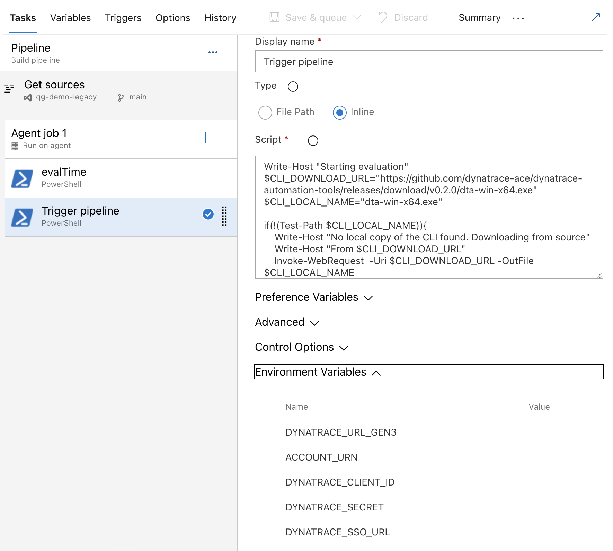
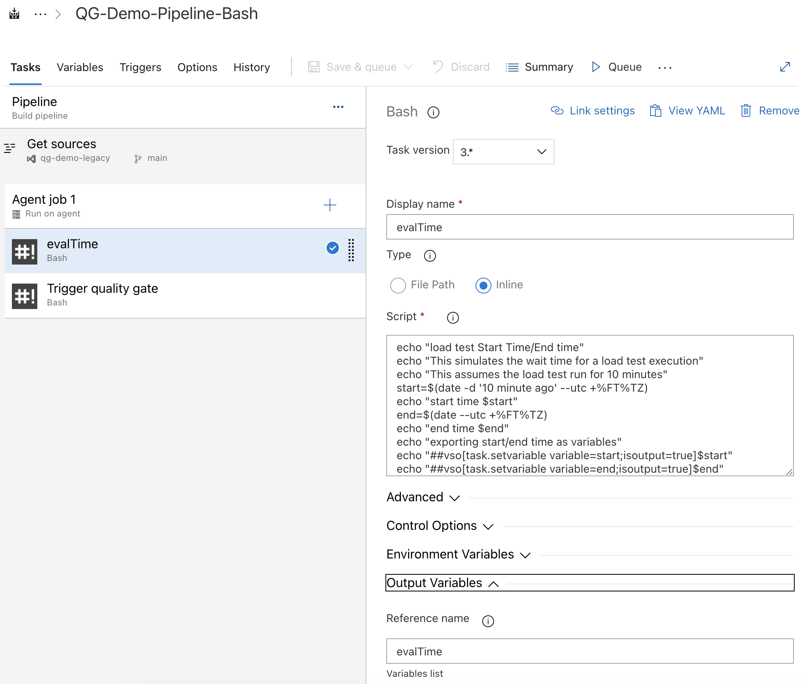
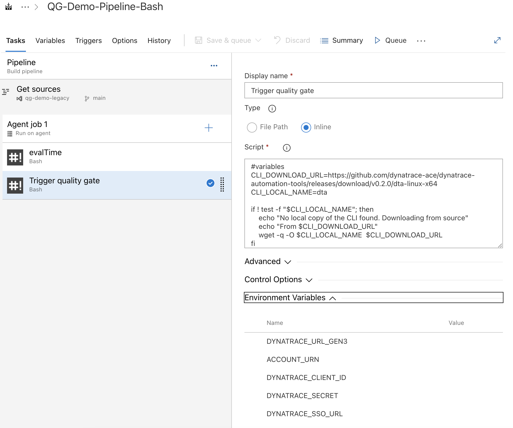

# Azure DevOps integration using Classic pipelines

> NOTE: Make sure you have already created a [Dynatrace Site Reliability Guardian and workflow](./../../SRGAutomation-initial-setup.md) before following this guide.

To integrate the CLI with Azure DevOps you can use the classic pipelines by inserting a task:

## Using PowerShell

1. You can use a PowerShell task to set the start/end time for the quality gate evaluation.

```(PowerShell)
Write-Host "load test Start Time/End time"
Write-Host "This simulates the wait time for a load test execution"
$end=(Get-Date).ToUniversalTime()
$end=$end.AddHours(-5)
Write-Host "This assumes the load test run for 10 minutes"
$start=$end.AddMinutes(-10).ToString('yyyy-MM-ddTHH:mm:ss.sssZ')
$end=$end.ToString('yyyy-MM-ddTHH:mm:ss.sssZ')
Write-Host "start time $start"
```

> Remember to set the **Output Variables** value to `evalTime`. This is the name that will be use in the next task to grab the variable values.



2.  This task will download the CLI and execute the command using the previous variables.

> Remember to update the CLI_DOWNLOAD_URL with the latest CLI version

```(PowerShell)
Write-Host "Starting evaluation"
$CLI_DOWNLOAD_URL="https://github.com/dynatrace-ace/dynatrace-automation-tools/releases/download/v1.0.0/dta-win-x64.exe"
$CLI_LOCAL_NAME="dta-win-x64.exe"

if(!(Test-Path $CLI_LOCAL_NAME)){
    Write-Host "No local copy of the CLI found. Downloading from source"
    Write-Host "From $CLI_DOWNLOAD_URL"
    Invoke-WebRequest  -Uri $CLI_DOWNLOAD_URL -OutFile $CLI_LOCAL_NAME
}

.\dta-win-x64.exe srg evaluate --start-time=$(evalTime.start) --end-time=$(evalTime.end) --stage="dev" --service="demo"
```



## Using Bash

1. You can use a Bash task to set the start/end time for the quality gate evaluation.

```(bash)
echo "load test Start Time/End time"
echo "This simulates the wait time for a load test execution"
echo "This assumes the load test run for 10 minutes"
start=$(date -d '10 minute ago' --utc +%FT%TZ)
echo "start time $start"
end=$(date --utc +%FT%TZ)
echo "end time $end"
echo "exporting start/end time as variables"
echo "##vso[task.setvariable variable=start;isoutput=true]$start"
echo "##vso[task.setvariable variable=end;isoutput=true]$end"
```



> Remember to set the **Output Variables** value to `evalTime`. This is the name that will be use in the next task to grab the variable values.

1. This task will download the CLI and execute the command using the previous variables.

> Remember to update the CLI_DOWNLOAD_URL with the latest CLI version

```(bash)
#variables
CLI_DOWNLOAD_URL=https://github.com/dynatrace-ace/dynatrace-automation-tools/releases/download/v1.0.0/dta-linux-x64
CLI_LOCAL_NAME=dta

if ! test -f "$CLI_LOCAL_NAME"; then
    echo "No local copy of the CLI found. Downloading from source"
    echo "From $CLI_DOWNLOAD_URL"
    wget -q -O $CLI_LOCAL_NAME  $CLI_DOWNLOAD_URL
fi

chmod +rx $CLI_LOCAL_NAME
 ./$CLI_LOCAL_NAME srg evaluate --start-time=$(evalTime.start) --end-time=$(evalTime.end) --stage="dev" --service="demo"
```


