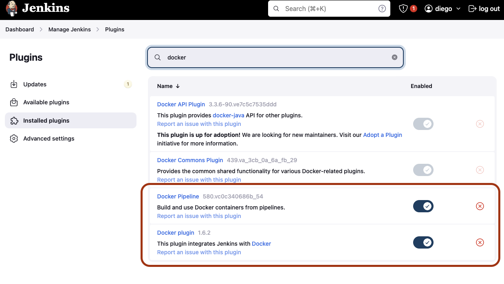

# Jenkins integration

For Jenkins, there are 2 options if you want to use containers:

## Option 1 - Existing Jenkins installation

For an existing Jenkins instance. You will need to install the Docker and Docker Pipelines plugin.


Then you can create a new pipeline with the following code

```(jenkins)
pipeline {
    agent {
        docker { image 'dynatraceace/dt-automation-cli:1.0' }
    }
        environment {
        // Credentials  (This are the required credentials to connect to Dynatrace. For more info check the main docs)
        DYNATRACE_URL_GEN3 = 'https://xxxx'
        ACCOUNT_URN = 'urn:dtaccount:xxxx' //credentials('ACCOUNT_URN')
        DYNATRACE_CLIENT_ID = 'dt0s02.xxxx' //credentials('DYNATRACE_CLIENT_ID')
        DYNATRACE_SECRET = 'dt0s02.xxxx.xxxxxx' //credentials('DYNATRACE_SECRET')
        DYNATRACE_SSO_URL = '' //credentials('DYNATRACE_SSO_URL')
        SRG_EVALUATION_SERVICE = 'your-service-name'
        SRG_EVALUATION_STAGE = 'your-service-stage'
    }
    stages {
        stage('Run performance test API') {
            steps {
                //this sets the start time of the evaluation
                sh 'echo $(date --utc +%FT%T.000Z) > srg.test.starttime'
                stash includes: 'srg.test.starttime', name: 'srg.test.starttime'
                //waits 60 seconds to simulate a performance test execution

                 sh 'sleep 60s'

                sh 'echo $(date --utc +%FT%T.000Z) > srg.test.endtime'
                //this sets the end time of the evaluation
                stash includes: 'srg.test.endtime', name: 'srg.test.endtime'
            }
        }
             stage('Quality Gate') {
            steps {
                unstash 'srg.test.starttime'
                unstash 'srg.test.endtime'

                sh """
                        eval_start=\$(cat srg.test.starttime)
                        eval_end=\$(cat srg.test.endtime)
                        dta srg evaluate --start-time \$eval_start --end-time \$eval_end
                    """
                    }
            }
        }
    }
```

## Option 2 - Using Jenkins as code

If you are using Jenkins as code, you can include a definition to create an agent with the Dynatrace Automation CLI and then referencing that agent in the pipeline. You can take a look at the [complete file here](./example.Jenkinsfile)

To create an agent you need to specify the agent in the configuration (using Jenkins as Code as reference)

```(yaml)
- containers:
- args: "cat"
    command: "/bin/sh -c"
    image: "dynatraceace/dt-automation-cli:latest"
    livenessProbe:
    failureThreshold: 0
    initialDelaySeconds: 0
    periodSeconds: 0
    successThreshold: 0
    timeoutSeconds: 0
    name: "dta"
    ttyEnabled: true
    workingDir: "/home/jenkins/agent"
label: "dta-runner"
name: "dta-runner"
slaveConnectTimeout: 300
slaveConnectTimeoutStr: "300"
yamlMergeStrategy: "override"

```

> Note: As a best practice replace the `latest` tag with a specific image version.
> Note: Alternately, some version of Jenkins can directly consume docker containers when combined with Docker plugins. So you don't need to install the container before using the docker image in the pipeline.

Then you can create a new quality gate step in a Jenkins pipeline like:

```(jenkins)
pipeline {
    environment {
        // Credentials  (This are the required credentials to connect to Dynatrace. For more info check the main docs)
        DYNATRACE_URL_GEN3 = "${env.DYNATRACE_URL_GEN3}"
        ACCOUNT_URN = credentials('ACCOUNT_URN')
        DYNATRACE_CLIENT_ID = credentials('DYNATRACE_CLIENT_ID')
        DYNATRACE_SECRET = credentials('DYNATRACE_SECRET')
        DYNATRACE_SSO_URL = credentials('DYNATRACE_SSO_URL')
        SRG_EVALUATION_SERVICE = 'your-service-name'
        SRG_EVALUATION_STAGE = 'your-stage-name'
    }
    stages {
        stage('Quality Gate') {
            agent {
                label 'dta-runner'
            }
            steps {
                    container('dta') {
                    sh """
                        dta srg evaluate
                    """
                    }
            }
        }
    }
}
```

If you want to run a load test and then specify the start time and end time of the evaluation as the start and end time of the test use the following code:

```(jenkins)
pipeline {
    environment {
        // Credentials  (This are the required credentials to connect to Dynatrace. For more info check the main docs)
        DYNATRACE_URL_GEN3 = "${env.DYNATRACE_URL_GEN3}"
        ACCOUNT_URN = credentials('ACCOUNT_URN')
        DYNATRACE_CLIENT_ID = credentials('DYNATRACE_CLIENT_ID')
        DYNATRACE_SECRET = credentials('DYNATRACE_SECRET')
        DYNATRACE_SSO_URL = credentials('DYNATRACE_SSO_URL')
        SRG_EVALUATION_SERVICE = 'your-service-name'
        SRG_EVALUATION_STAGE = 'your-stage-name'
    }
    stages {
      //This performance test uses locust but you can use any testing/load generating tool
        stage('Run performance test API') {
            agent {
                label 'locust-runner'
            }
            steps {
                checkout scm
                //this sets the start time of the evaluation
                sh 'echo $(date --utc +%FT%T.000Z) > srg.test.starttime'
                stash includes: 'srg.test.starttime', name: 'srg.test.starttime'
                container('locust') {
                    script {
                        sh "echo ${env.LOCUST_HOST}"
                        sh "locust --headless --locustfile locustfile.py -t 5m -u 10 -r 10 --host http://testing-app-environment.com"
                    }
                }
                sh 'echo $(date --utc +%FT%T.000Z) > srg.test.endtime'
                //this sets the end time of the evaluation
                stash includes: 'srg.test.endtime', name: 'srg.test.endtime'
            }
        }
        stage('Quality Gate') {
            agent {
                label 'dta-runner'
            }
            steps {
                    container('dta') {
                    sh """
                        eval_start=\$(cat srg.test.starttime)
                        eval_end=\$(cat srg.test.endtime)
                        dta srg evaluate --start-time \$eval_start --end-time \$eval_end
                    """
                    }
            }
        }
    }
}

```
